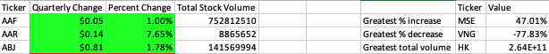

# VBA Stock Market Analysis
**Creator**: Angelina Murdock  
**Date**: January 2025

## Overview
This project uses **VBA scripting in Excel** to automate the analysis of stock market data across multiple worksheets, each representing a different financial quarter. The script processes large datasets of daily trading activity, calculating key performance metrics for each stock ticker and identifying top market performers.

## Table of contents
- [Overview](#overview)
- [Features](#features)
- [Installation](#installation)
- [Resources](#resources)

## Features
- **Loop Through All Worksheets**

    Automatically processes stock data across all quarterly worksheets in a workbook

- **Quarterly Stock Analysis**

    For each stock ticker:
    - Calculates the change in price over the quarter
    - Calculates percentage change
    - Sums the total stock volume

- **Top Performer Summary**
    - Greatest % increase
    - Greatest % decrease
    - Greatest total volume

- **Formatted Output Example**

    For each worksheet (quarter), the script outputs:
    

## Installation
### Requirements
- Microsoft Excel (2016 or later recommended)
- Macros enabled

### Set up
1. Clone or download the repository from GitHub:
    ``` bash
    git clone https://github.com/Angelinamurdock/VBA-challenge.git 
    ```
2. Open the Excel workbook named `Multiple_year_stock_data_final.xlsm` from the cloned/downloaded folder.
3. Enable macros if prompted.
4. To view or edit the script:
- Open the VBA Editor
- The analysis script will be located under Modules
5. Run the macro from Excel:
- Go to the Developer tab
- Click Macros, select the macro and click Run


## Resources
- **DU Bootcamp Module 2:** Used challenge files and class materials from the bootcamp.
- **ChatGPT:** Assisted with code explanations and debugging.
